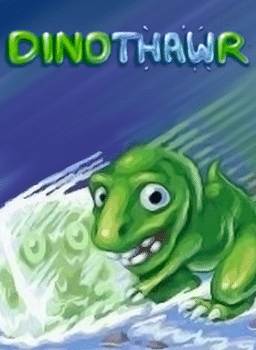
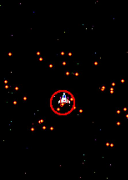
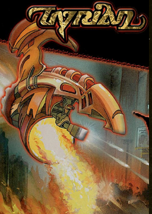
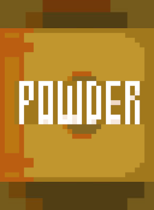
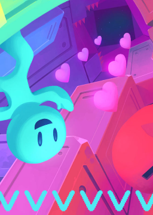
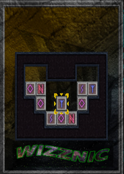

| Directory | Image | Size | Download Link | Download Link |
| :--------: | :---: | :--: | :-----------: | :-----------: |
|  [Bfruit.PyGame](https://github.com/schmurtzm/test-repo/releases/download/v4.7.3/Bfruit.PyGame.7z) 111K |  [C-Dogs](https://github.com/schmurtzm/test-repo/releases/download/v4.7.3/C-Dogs.7z) 52K |  [Cave.Story.NXEngine](https://github.com/schmurtzm/test-repo/releases/download/v4.7.3/Cave.Story.NXEngine.7z) 71K |  [Diablo.devilutionX](https://github.com/schmurtzm/test-repo/releases/download/v4.7.3/Diablo.devilutionX.7z) 94K |  [Dinothawr](https://github.com/schmurtzm/test-repo/releases/download/v4.7.3/Dinothawr.7z) 49K | 
|  [Double.Cross.v.2.0.PyGame](https://github.com/schmurtzm/test-repo/releases/download/v4.7.3/Double.Cross.v.2.0.PyGame.7z) 54K |  [Exhumed.-.Demo.PCExhumed](https://github.com/schmurtzm/test-repo/releases/download/v4.7.3/Exhumed.-.Demo.PCExhumed.7z) 140K |  [Ganbare.natsuki.san](https://github.com/schmurtzm/test-repo/releases/download/v4.7.3/Ganbare.natsuki.san.7z) 159K |  [Ghost.Safety.Squad.PyGame](https://github.com/schmurtzm/test-repo/releases/download/v4.7.3/Ghost.Safety.Squad.PyGame.7z) 87K |  [Hocoslamfy](https://github.com/schmurtzm/test-repo/releases/download/v4.7.3/Hocoslamfy.7z) 24K | 
|  [Hydra.Castle.Labyrinth](https://github.com/schmurtzm/test-repo/releases/download/v4.7.3/Hydra.Castle.Labyrinth.7z) 93K |  [Man20s](https://github.com/schmurtzm/test-repo/releases/download/v4.7.3/Man20s.7z) 24K |  [Minesweeper.PyGame](https://github.com/schmurtzm/test-repo/releases/download/v4.7.3/Minesweeper.PyGame.7z) 20K |  [Nannoid.PyGame](https://github.com/schmurtzm/test-repo/releases/download/v4.7.3/Nannoid.PyGame.7z) 124K |  [OpenTyrian](https://github.com/schmurtzm/test-repo/releases/download/v4.7.3/OpenTyrian.7z) 177K | 
|  [Powder](https://github.com/schmurtzm/test-repo/releases/download/v4.7.3/Powder.7z) 6.2K |  [Rick.Dangerous.XRick](https://github.com/schmurtzm/test-repo/releases/download/v4.7.3/Rick.Dangerous.XRick.7z) 167K |  [Snake.PyGame](https://github.com/schmurtzm/test-repo/releases/download/v4.7.3/Snake.PyGame.7z) 29K |  [Street.of.Rage.Remake](https://github.com/schmurtzm/test-repo/releases/download/v4.7.3/Street.of.Rage.Remake.7z) 161K |  [Tower.of.the.Sorcerer.v2.0.PyGame](https://github.com/schmurtzm/test-repo/releases/download/v4.7.3/Tower.of.the.Sorcerer.v2.0.PyGame.7z) 182K | 
|  [Ultimate.Avalanche.2.0.PyGame](https://github.com/schmurtzm/test-repo/releases/download/v4.7.3/Ultimate.Avalanche.2.0.PyGame.7z) 20K |  [Vvvvvv](https://github.com/schmurtzm/test-repo/releases/download/v4.7.3/Vvvvvv.7z) 102K |  [Wizznic](https://github.com/schmurtzm/test-repo/releases/download/v4.7.3/Wizznic.7z) 144K |  [Zelda.Picross](https://github.com/schmurtzm/test-repo/releases/download/v4.7.3/Zelda.Picross.7z) 145K | 
These ports are free to play and contains all required assets.
|        |        |        |        |        |
| :----: | :----: | :----: | :----: | :----: |
|  [C-Dogs](https://github.com/schmurtzm/test-repo/releases/download/v5.0.1/C-Dogs.7z) 52K |  [Ultimate Avalanche 2.0 (PyGame)](https://github.com/schmurtzm/test-repo/releases/download/v5.0.1/Ultimate.Avalanche.2.0.PyGame.7z) 20K | 
The assets of these ports are licensed and must be added manually. Only open source engines and configuration are included.
|        |        |        |        |        |
| :----: | :----: | :----: | :----: | :----: |
|  [Duke Caribbean Life's a Beach (eduke32)]()  |  [Duke!ZONE II (eduke32)](https://github.com/schmurtzm/test-repo/releases/download/v5.0.1/Duke.ZONE.II.eduke32.7z) 1.2M |  [Quake dopa - 2021 (TyrQuake)](https://github.com/schmurtzm/test-repo/releases/download/v5.0.1/Quake.dopa.-.2021.TyrQuake.7z) 120K |  [Wolfenstein - Coffee-break-episode-1-2](https://github.com/schmurtzm/test-repo/releases/download/v5.0.1/Wolfenstein.-.Coffee-break-episode-1-2.7z) 28K | 
These ports are free to play and contains all required assets.
|        |        |        |        |        |
| :----: | :----: | :----: | :----: | :----: |
|  [C-Dogs](https://github.com/schmurtzm/test-repo/releases/download/v5.0.1/C-Dogs.7z) 52K |  [Ultimate Avalanche 2.0 (PyGame)](https://github.com/schmurtzm/test-repo/releases/download/v5.0.1/Ultimate.Avalanche.2.0.PyGame.7z) 20K | 

The assets of these ports are licensed and must be added manually. Only open source engines and configuration are included.
|        |        |        |        |        |
| :----: | :----: | :----: | :----: | :----: |
|  [Duke Caribbean Life's a Beach (eduke32)]()  |  [Duke!ZONE II (eduke32)](https://github.com/schmurtzm/test-repo/releases/download/v5.0.1/Duke.ZONE.II.eduke32.7z) 1.2M |  [Quake dopa - 2021 (TyrQuake)](https://github.com/schmurtzm/test-repo/releases/download/v5.0.1/Quake.dopa.-.2021.TyrQuake.7z) 120K |  [Wolfenstein - Coffee-break-episode-1-2](https://github.com/schmurtzm/test-repo/releases/download/v5.0.1/Wolfenstein.-.Coffee-break-episode-1-2.7z) 28K | 
These ports are free to play and contains all required assets.
|        |        |        |        |        |
| :----: | :----: | :----: | :----: | :----: |
|  [C-Dogs](https://github.com/schmurtzm/test-repo/releases/download/v5.0.1/C-Dogs.7z) 52K |  [Ultimate Avalanche 2.0 (PyGame)](https://github.com/schmurtzm/test-repo/releases/download/v5.0.1/Ultimate.Avalanche.2.0.PyGame.7z) 20K | 

The assets of these ports are licensed and must be added manually. Only open source engines and configuration are included.
|        |        |        |        |        |
| :----: | :----: | :----: | :----: | :----: |
|  [Duke Caribbean Life's a Beach (eduke32)]()  |  [Duke!ZONE II (eduke32)](https://github.com/schmurtzm/test-repo/releases/download/v5.0.1/Duke.ZONE.II.eduke32.7z) 1.2M |  [Quake dopa - 2021 (TyrQuake)](https://github.com/schmurtzm/test-repo/releases/download/v5.0.1/Quake.dopa.-.2021.TyrQuake.7z) 120K |  [Wolfenstein - Coffee-break-episode-1-2](https://github.com/schmurtzm/test-repo/releases/download/v5.0.1/Wolfenstein.-.Coffee-break-episode-1-2.7z) 28K | 
These ports are free to play and contains all required assets.
|        |        |        |        |        |
| :----: | :----: | :----: | :----: | :----: |
|  [C-Dogs](https://github.com/schmurtzm/test-repo/releases/download/v5.0.1/C-Dogs.7z) 52K |  [Ultimate Avalanche 2.0 (PyGame)](https://github.com/schmurtzm/test-repo/releases/download/v5.0.1/Ultimate.Avalanche.2.0.PyGame.7z) 20K | 

The assets of these ports are licensed and must be added manually. Only open source engines and configuration are included.
|        |        |        |        |        |
| :----: | :----: | :----: | :----: | :----: |
|  [Duke Caribbean Life's a Beach (eduke32)](https://github.com/schmurtzm/test-repo/releases/download/v5.0.1/Duke.Caribbean.Life.s.a.Beach.eduke32.7z) 2.6M |  [Duke!ZONE II (eduke32)](https://github.com/schmurtzm/test-repo/releases/download/v5.0.1/Duke.ZONE.II.eduke32.7z) 1.2M |  [Quake dopa - 2021 (TyrQuake)](https://github.com/schmurtzm/test-repo/releases/download/v5.0.1/Quake.dopa.-.2021.TyrQuake.7z) 120K |  [Wolfenstein - Coffee-break-episode-1-2](https://github.com/schmurtzm/test-repo/releases/download/v5.0.1/Wolfenstein.-.Coffee-break-episode-1-2.7z) 28K | 
